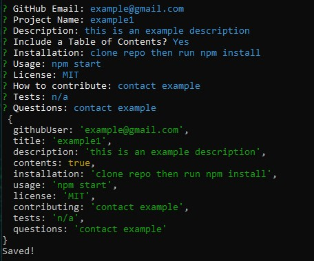

# Readme generator

## Description 

CLI utilizing inquirer package that generates a readme from user inputs

## Installation

clone repo

-then-

`npm install`

to install dependencies

## Usage
navigate to repo in terminal then 

`npm start`

answer questions in the command line

readme will be generated in root of repo as `HOMEWORK README.md`

## License

## Contributing

Pull requests are welcome. For major changes, please open an issue first to discuss what you would like to change.
